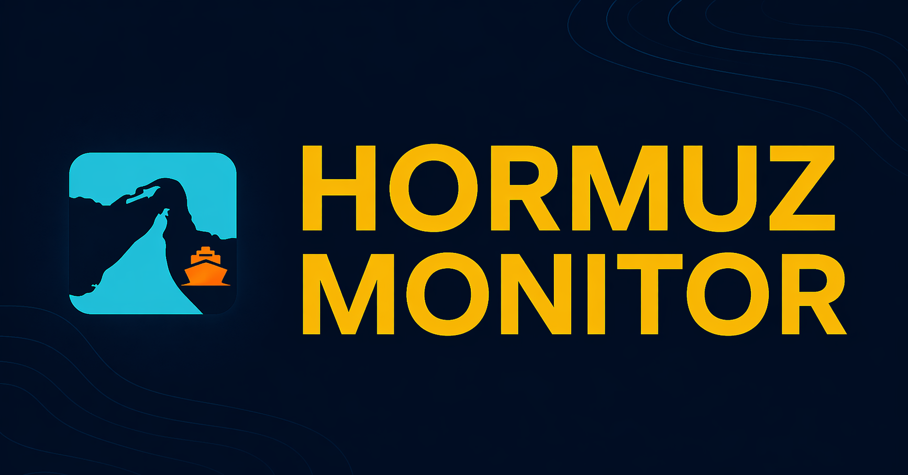
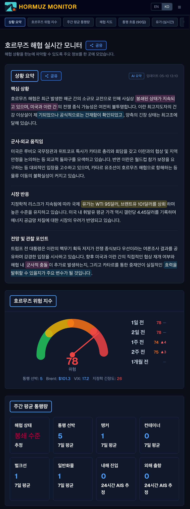
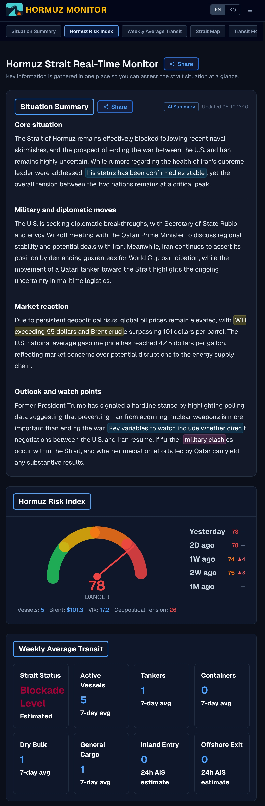
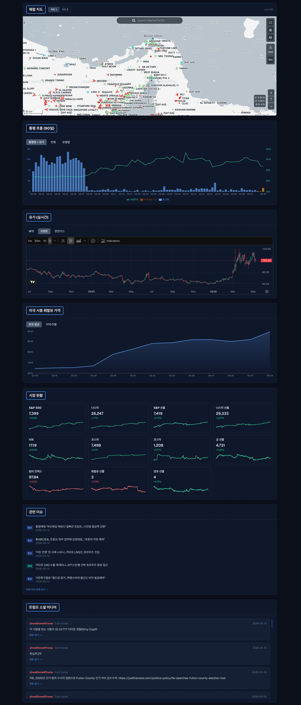
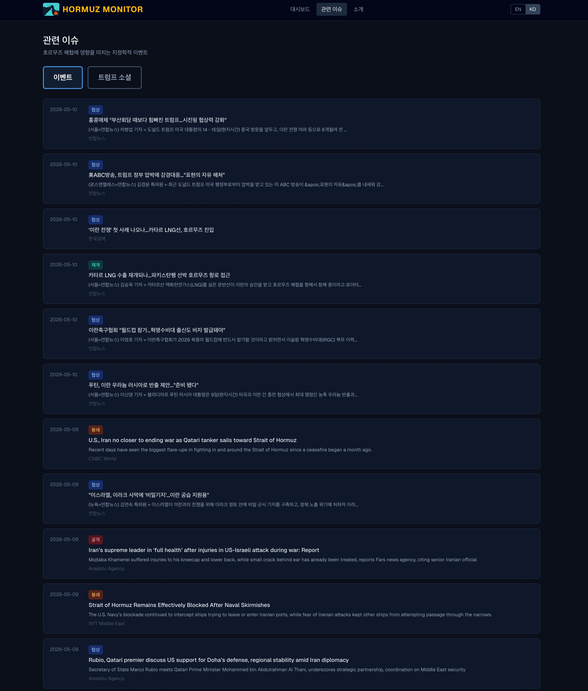

# Hormuz Monitor

[](README.md)
[](README.en.md)


## Project Overview

Hormuz Monitor is a real-time dashboard designed to quickly check geopolitical tension and supply chain risks around the Strait of Hormuz. It aggregates vessel traffic, energy prices, market indicators, related news, and political statements into a single interface for comprehensive situation awareness.

The service supports both Korean and English, automatically localizing dashboard labels, summaries, and shared content based on user language preferences and environment settings.

Live Website: [https://www.hrmz.today](https://www.hrmz.today)

<a href="https://www.hrmz.today">
  
</a>

## Key Screens

### Multilingual Mobile Dashboard

<table>
  <tr>
    <td width="50%">
      
    </td>
    <td width="50%">
      
    </td>
  </tr>
</table>

Supports Korean and English, featuring a sticky top section navigation bar on mobile for quick access to key dashboard modules.

### AI Situation Summary & Risk Index

AI synthesizes US-Iran conflict developments, Strait of Hormuz tensions, and energy/market impacts into concise situation updates. The Risk Index combines vessel transit, geopolitical tension scores, crude oil prices, and market volatility to present the current risk level.

### Vessel Traffic, Energy & Market Indicators



Includes a MarineTraffic-powered real-time map, vessel flow metrics, ship breakdown, and crude oil trends. Provides 5-minute and daily candlestick charts for WTI, Brent, Natural Gas, US Gasoline retail prices, Gold futures, Dollar Index, Gasoline futures, Heating Oil futures, VIX, and major US and Korean stock indices.

### Related News & Political Statements



Aggregates related news articles with AI-generated summaries upon clicking. Provides Korean translations for English articles, as well as translated Trump Truth Social posts.

## Key Features

- Situation summary related to the Strait of Hormuz
- Risk Index incorporating vessel transit, geopolitical tension, energy prices, and market volatility
- 7-day average transit volume and 24-hour estimated AIS direction statistics
- Monitoring of Strait map, vessel flow, oil prices, gasoline prices, and market conditions
- Related news article feed with summary modal
- Political statement monitoring and translations
- Sticky top navigation menu tailored for mobile screens
- Multilingual support for Korean and English

## Tech Stack

| Domain | Technology |
| --- | --- |
| Frontend | Next.js, React, TypeScript |
| Backend | Python, FastAPI |
| Database | Supabase PostgreSQL |
| Infrastructure | Vercel, Render, Cloudflare |
| AI | Google Generative Language API |
| Analytics | Google Analytics |

## Architecture at a Glance

```text
User
  |
  v
Cloudflare
  |
  v
Vercel Frontend
  |
  |-- Fetch dashboard data
  |-- Call article summary API
  |
  v
Supabase PostgreSQL
  ^
  |
Render Backend / Scheduled Jobs
  |-- Collect market & energy indicators
  |-- Process vessel transit data
  |-- Collect related news & political statements
  |-- Generate situation summary & Risk Index
  |-- Clean up expired temporary data
```
